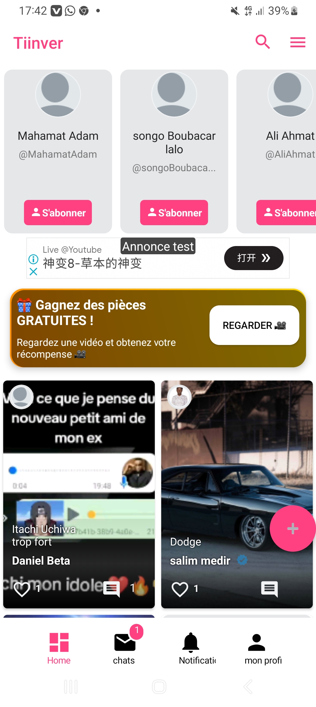
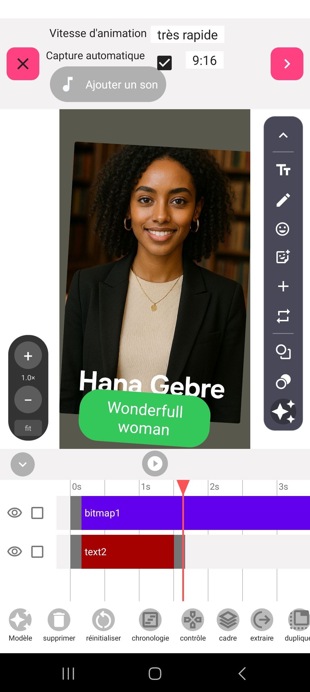
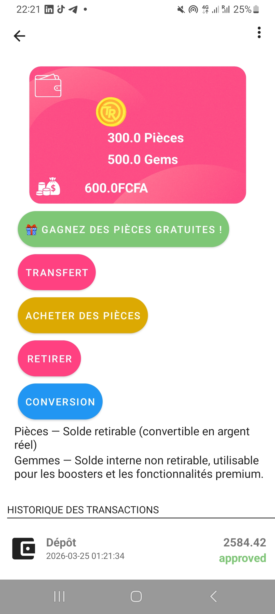
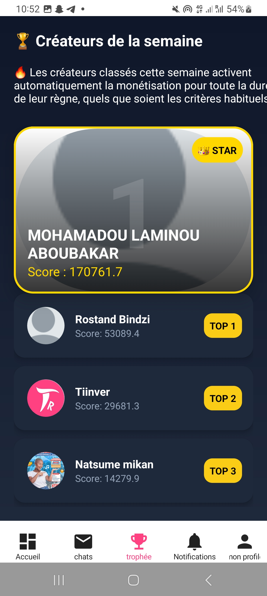

# Tiinver — Showcase

Réseau social de monétisation pour créateurs africains.
Développé entièrement par Salim Medir.

## 📱 Disponible sur
[Google Play Store](https://play.google.com/store/apps/details?id=com.tiinver)

## 🛠️ Technologies utilisées
- Android natif : Kotlin / Java
- API REST : PHP
- Temps réel : Node.js + Socket.io
- Blockchain : Node.js
- Base de données : MySQL

## ✨ Fonctionnalités
- Messagerie instantanée (texte, vidéo, audio, photo)
- Groupes payants avec abonnement mensuel
- Retrait instantané via Mobile Money
- Animemes (animations personnalisées)
- Cryptomonnaies intégrées

## 📊 Chiffres
- 10 000+ créateurs actifs

## 📸 Screenshots

  
  
  
   
   

